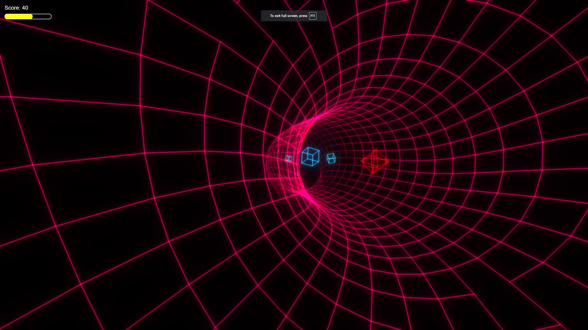

# Wireframe Flythrough Game

A 3D wireframe tunnel game built with Three.js where you navigate through a colorful wireframe tunnel, collect boxes, and avoid barriers.

## Game Overview

Wireframe Flythrough is an immersive 3D game where you control a camera flying through a wireframe tunnel. The game features:

- A dynamic wireframe tunnel that continuously generates ahead of you
- Collectible boxes that increase your score
- Red barrier obstacles that reduce your health
- Smooth camera controls with automatic centering
- Stylish UI with start menu, game over screen, and victory screen
- Customizable wireframe color
- Precise collision detection for accurate gameplay

## How to Play

### Controls
- **W / Up Arrow**: Move up
- **S / Down Arrow**: Move down
- **A / Left Arrow**: Move left
- **D / Right Arrow**: Move right

### Gameplay
1. Start the game by clicking the "START" button on the main menu
2. Navigate through the wireframe tunnel using the WASD or arrow keys
3. Collect white/colored boxes to increase your score (10 points each)
4. Avoid the red octahedron barriers - hitting them reduces your health by 20 points
5. Reach 200 points to win the game
6. If your health reaches 0, the game ends

### Customization
- Click the "CHANGE WIREFRAME COLOR" button on the start menu to randomly change the color of the wireframe tunnel
- A popup will briefly show the selected color before automatically disappearing
- The title's glow effect will also change to match the selected color

### Game States
- **Menu**: The starting screen with a "START" button and color picker
- **Playing**: The active gameplay state
- **Game Over**: Appears when your health reaches 0, showing your final score
- **Win**: Appears when you reach 200 points, showing your final score

## Features

### Visual Effects
- Wireframe tunnel with continuous generation
- Colorful collectible boxes with random colors
- Red barrier obstacles
- Bloom post-processing effect for a glowing appearance
- Screen flash effects when hitting barriers or winning
- Customizable wireframe color
- Camera shake effect when colliding with barriers

### Game Mechanics
- Automatic tunnel movement
- Camera centering when no movement keys are pressed
- Advanced collision detection for boxes and barriers
  - Precise surface detection for octahedron barriers
  - Distance-based collision boundaries
  - Strict collision thresholds to prevent false positives
- Health system with visual feedback
- Score tracking
- Temporary invincibility after hitting a barrier

### UI Elements
- Score display
- Health display (changes color based on health level)
- Start menu with glowing title and buttons
- Game over screen with final score
- Victory screen with congratulations message
- Color picker with visual feedback

## Technical Details

The game is built using:
- Three.js for 3D rendering
- Custom spline-based tunnel generation
- Advanced collision detection using vector projections and surface detection
- Post-processing effects for visual enhancement
- Dynamic color generation and application

### Collision Detection System
The game features a sophisticated collision detection system:
- Surface-based detection for accurate collision with octahedron barriers
- Vector projection onto local axes to determine collision faces
- Distance-based checks to prevent false positives
- Configurable collision thresholds for fine-tuning gameplay feel
- Visual feedback (screen flash and camera shake) when collisions occur

## Installation

1. Clone this repository
2. Open `index.html` in a modern web browser
3. No additional setup required - the game runs directly in the browser

## Browser Compatibility

The game works best in modern browsers that support WebGL:
- Chrome
- Firefox
- Edge
- Safari

## Credits

Created as a Three.js wireframe tunnel game with added gameplay elements.